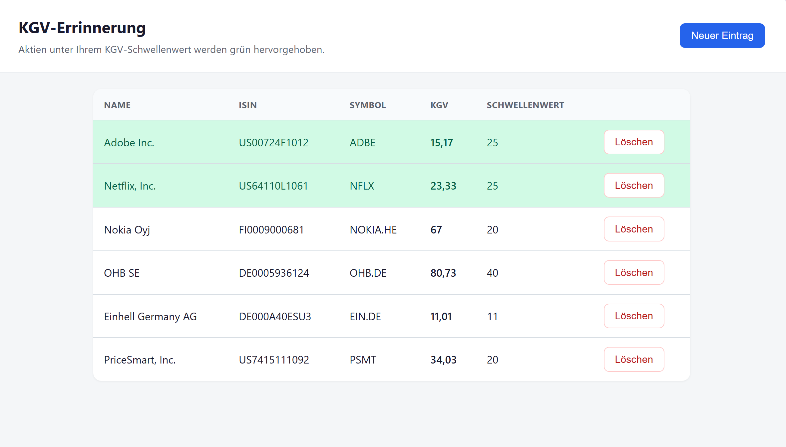

# KGV-Errinnerung

Kleine Webanwendung, mit der du Aktien anhand ihrer **ISIN** und eines **KGV-Schwellenwerts** überwachen kannst. Liegt das aktuelle Kurs-Gewinn-Verhältnis (KGV / P/E) **unter** dem Schwellenwert, wird die Zeile **grün** hervorgehoben — sonst ohne Hintergrund.



---

## Für Anwender: Installation im Home Lab

### Was die App macht

1. Beim Öffnen siehst du direkt deine Aktienliste.
2. Über **Neuer Eintrag** trägst du ISIN und KGV-Schwellenwert ein.
3. Die App holt das aktuelle KGV (Yahoo Finance) und zeigt Name sowie Börsensymbol an.
4. Zeilen mit KGV unter dem Schwellenwert erscheinen grün.
5. Einträge kannst du jederzeit löschen.

### Voraussetzungen

- Docker (empfohlen) **oder** Node.js 18+
- Internetzugang (OpenFIGI für ISIN→Symbol, Yahoo Finance für KGV)

### Docker (empfohlen)

Image aus dem Repository bauen:

```bash
docker build -t kgv-errinnerung .
```

Container starten (Daten dauerhaft speichern):

```bash
docker run -d \
  --name kgv-errinnerung \
  -p 3000:3000 \
  -v kgv-data:/app/data \
  -e TZ=Europe/Berlin \
  kgv-errinnerung
```

Danach im Browser: `http://localhost:3000`

#### Beispiel `docker-compose.yml`

```yaml
version: "3.0"
services:
  webserver:
    image: kgv-errinnerung   # oder darkcheyenne/kgv-errinnerung:<tag>
    environment:
      - TZ=Europe/Berlin
    volumes:
      - kgv-data:/app/data
    # Bei Reverse Proxy: Port 3000 an den Proxy weiterleiten
    # Ohne Proxy:
    # ports:
    #   - "3000:3000"

volumes:
  kgv-data:
```

**Wichtig:**

- Die App lauscht intern auf **Port 3000**.
- Volume auf `/app/data` mounten, sonst gehen Einträge beim Neustart verloren.
- `PUID`/`PGID` werden von dieser App **nicht** ausgewertet.

### Ohne Docker (lokal)

```bash
npm install
npm start
```

Umgebung:

| Variable   | Standard              | Bedeutung                          |
|------------|-----------------------|------------------------------------|
| `PORT`     | `3000`                | HTTP-Port                          |
| `DB_PATH`  | `./data/kgv.db`       | Pfad zur SQLite-Datei              |

### Nutzung

1. **Neuer Eintrag** → ISIN (12 Zeichen, z. B. `DE0007164600`) und Schwellenwert (z. B. `15`)
2. Nach dem Speichern erscheint die Aktie in der Liste mit aktuellem KGV.
3. Grün = aktuelles KGV **kleiner** als Schwellenwert.
4. Manche Aktien haben kein KGV (z. B. negative Gewinne) — dann steht „—“ und die Zeile bleibt ohne Hintergrund.

### Hinweise

- KGV-Daten kommen von **Yahoo Finance** und können verzögert oder unvollständig sein; keine Anlageberatung.
- Für nicht-US-Aktien braucht Yahoo oft ein Börsensuffix (z. B. `NOKIA.HE`, `SAP.DE`). Die App versucht das automatisch über OpenFIGI und Suche zu lösen.

---

## Für KI-Assistenten / spätere Wartung

Dieser Abschnitt richtet sich an Menschen oder Agenten, die die App später anpassen (API-Wechsel, neue Börsen, UI-Fixes).

### Zweck & Regeln

- **Produktziel:** Watchlist aus ISIN + persönlichem KGV-Schwellenwert; visuelle Ampel (grün = KGV &lt; Schwelle).
- **Vergleich:** `pe < threshold` (strikt kleiner). Gleichheit = **nicht** grün.
- **Kein Auth**, keine Benutzerkonten — Home-Lab / Single-User.
- Änderungen klein und fokussiert halten; bestehende UI- und API-Verträge nicht unnötig brechen.

### Architektur

```
Browser (public/)  →  Express (server.js)  →  SQLite (db.js)
                              ↓
                     stockService.js
                     ├─ OpenFIGI  (ISIN → Ticker + exchCode)
                     └─ yahoo-finance2 (KGV / Name)
```

| Datei | Rolle |
|-------|--------|
| `server.js` | Express, REST, Static Files, KGV-Anreicherung der Liste |
| `db.js` | SQLite öffnen, Verzeichnis anlegen, Schema |
| `stockService.js` | ISIN-Auflösung, Börsensuffixe, Yahoo-Quotes, Fallback-Suche |
| `public/` | `index.html`, `style.css`, `app.js`, `favicon.svg` |
| `Dockerfile` | `node:22-alpine`, `npm install --omit=dev`, Port 3000 |

### Datenbank

Tabelle `stocks`:

| Spalte | Typ | Hinweis |
|--------|-----|---------|
| `id` | INTEGER PK | |
| `isin` | TEXT UNIQUE | normalisiert uppercase |
| `name` | TEXT | optional, von Yahoo/OpenFIGI |
| `symbol` | TEXT | Yahoo-Symbol inkl. Suffix wenn nötig |
| `threshold` | REAL | Nutzer-Schwelle |
| `created_at` | TEXT | SQLite `datetime('now')` |

- Pfad: `DB_PATH` oder `data/kgv.db`
- **`db.js` muss das Verzeichnis vor `new Database(...)` anlegen** — sonst Docker-Crash, wenn Volume/`data` fehlt.
- KGV wird **nicht** persistiert; bei jedem `GET /api/stocks` live geladen.

### API

| Methode | Pfad | Verhalten |
|---------|------|-----------|
| `GET` | `/api/stocks` | Alle Einträge + Live-KGV; bei „quote not found“ Symbol neu auflösen und speichern |
| `POST` | `/api/stocks` | Body `{ isin, threshold }`; ISIN-Regex; Duplikat → 409 |
| `DELETE` | `/api/stocks/:id` | Eintrag löschen |

Antwortfelder u. a.: `pe`, `belowThreshold`, `error` (String bei Quote-/Netzfehlern).

### Externe Abhängigkeiten (häufige Bruchstellen)

1. **`yahoo-finance2` (aktuell v3)**  
   - Import: `const YahooFinance = require('yahoo-finance2').default;` dann `new YahooFinance()`.  
   - **Nicht** die Klassenmethode ohne Instanz aufrufen (typischer Upgrade-Fehler v2→v3).  
   - KGV: `quoteSummary(symbol, { modules: ['summaryDetail', 'price'] })` → `trailingPE` / Fallback `forwardPE`.  
   - Upgrade-Doku: https://github.com/gadicc/yahoo-finance2/blob/dev/docs/UPGRADING.md  

2. **OpenFIGI** `POST https://api.openfigi.com/v3/mapping`  
   - Body: `[{ idType: 'ID_ISIN', idValue }]`  
   - Liefert oft Ticker **ohne** Yahoo-Suffix → Mapping in `EXCHANGE_SUFFIX` (`stockService.js`).  
   - Rate Limits / Key: unauthentifiziert möglich, bei Missbrauch Limits; ggf. `X-OPENFIGI-APIKEY`.

3. **Yahoo-Suche als Fallback**  
   - Wenn Suffix/Mapping fehlschlägt: `yahooFinance.search(isin)` und Suche nach Name/Ticker, dann erstes funktionierendes Equity-Symbol.

### Bekannte Fallstricke

- **Europäische ISINs:** OpenFIGI → z. B. `NOKIA` ohne `.HE` → „Quote not found“. Fix: Mapping erweitern oder Fallback-Suche (bereits implementiert).
- **Docker:** Image nach Dependency-Änderungen **neu bauen** (`npm install` läuft nur beim Build).
- **Persistenz:** ohne Volume auf `/app/data` gehen Daten verloren.
- **Native Modul:** `better-sqlite3` muss zur Container-Architektur passen (Alpine/Node 22 im Dockerfile).
- **Kein package-lock im Fokus:** reproduzierbare Builds ggf. `package-lock.json` committen.

### Typische Wartungsaufgaben

| Symptom | Wo schauen |
|---------|------------|
| `YahooFinance is not a constructor` / „Call new YahooFinance() first“ | `stockService.js` Import/Instanz; `package.json` Major von yahoo-finance2 |
| `Cannot open database because the directory does not exist` | `db.js` — Ordner vor Open anlegen |
| ISIN ok, „Quote not found for symbol: XYZ“ | `EXCHANGE_SUFFIX` + `findWorkingSymbol` / Search-Fallback |
| KGV immer `null` / „—“ | Yahoo liefert kein PE; UI zeigt absichtlich „—“ |
| UI lädt nicht | Static under `public/`, Express `express.static` |

### Lokales Dev (für Agenten mit Shell)

```bash
npm install
npm start          # http://localhost:3000
npm run dev        # node --watch
```

Auf manchen Cursor-/Windows-Setups darf der Agent **keinen** lokalen Start ausführen — dann nur Code ändern; Nutzer deployed per Docker und liefert ggf. URL zum Testen.

### Stil & Scope

- Deutsch in der UI; Code-Kommentare sparsam und auf „Warum“.
- Keine unnötigen Frameworks; Vanilla Frontend reicht.
- Tests fehlen bewusst (kleine App) — bei API-Umbau manuell: ISIN-US + europäische ISIN (z. B. `FI0009000681`) hinzufügen, Grün-Logik und Löschen prüfen.
